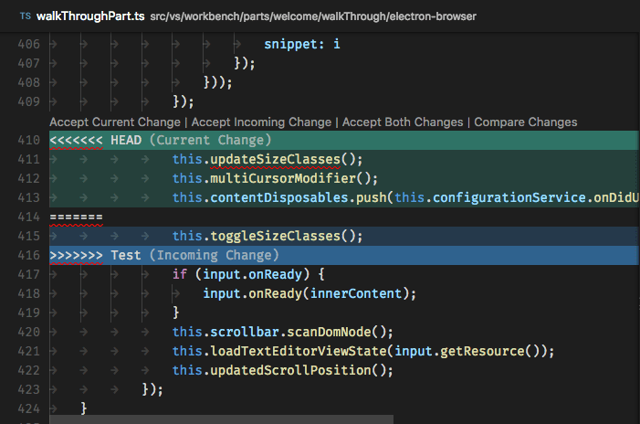
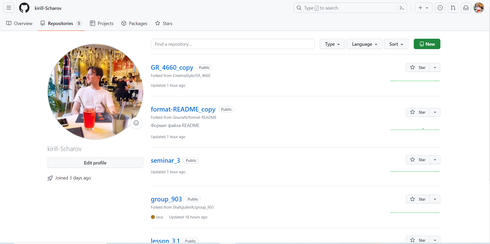
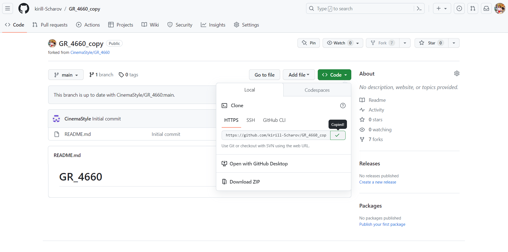
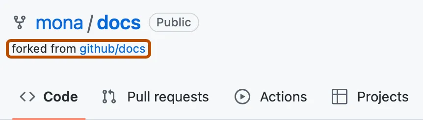

# GR_4660

# Инструкция по работе с системой контроля версий Git 

## Что такое Git?

Git - это одна из реализаций распределённых систем контроля версий, имеющая как и локальные, так и удалённфе репозитории. Является самой популярной реализацией систем контроля версий в мире.  

 

## Подготовка репозитория
Для создания репозитория необходимо выполнять команду *git init* в папке с репозиторием. Будет создана **скрытая** папка .git.

## Создание коммитов

### Git add
Для добавления изменений в коммит используется команда *git add*. Чтобы использовать команду *git add* напишите *git add <имя файла>*. Для добавления всех файлов используйте команду *"git add ."*
>Более подробную информацию об этих командах можно посмотреть на [официальном сайте][def].

### Просмотр состояния репозитория

Для того, чтобы посмотреть состояние репозитория используется команда *git status*. Для этого необходимо в папке с репозиторием написать *git status*.

### Создание коммитов

Для того, чтобы создать коммит (сохранение) необходимо выполнить команду *git commit*. Выполняется она так: *git commit -m "<сообщение к коммиту>". Все файлы для коммита должны быть *__ДОБАВЛЕНЫ__* и сообщение к коммиту писать *__ОБЯЗАТЕЛЬНО__*.

## Перемещение между сохранениями

Для того, чтобы перемещаться между коммитами, используется команда *git checkout*. Используется она в папке с репозиторием следующим образом: *git checkout <номер коммита>*.

> &#9888; **Warning!**  
> Во избежание ошибок, обязательно вернитесь на конец ветки **master** (**HEAD**) с помошью команды *git checkout master*.

## Журнал изменений

Для того, чтобы посмотреть все сделанные изменения в репозитории, используется команда *git log*. Для этого достаточно выполнить команду *git log* в папке с репозиторием

## Ветки в git

### Создание ветки

Для того, чтобы создать ветку, используется команда *git branch*. Делается это следующим образом в папке с репозиторием: *git branch <название новой ветки>*.

> &#128712; **Information**  
> Для вывода списка веток изпользуйте команду *git branch*. Ветка, на которой Вы сейчас находитесь будет отмечена звёздочкой (\*).

### Слияние веток и решение конфликтов

Для того, чтобы добавить ветку в текущую ветку используется команда *git merge*. Команда будет выглядеть следующим образом: *git merge <название ветки>*.

> &#9757; **Important**  
> Важно помнить, что слияние веток происходит в ту, из которой Вы вызываете *git merge*.

Иногда, если в сливаемых ветках в одном и том же месте указаны разные данные, может возникнуть конфликт.  

В этом случае VS Code предложит Вам принять текущие (Current) изменения, входящие (Incoming) изменения, оба (Both) изменения или сравнить изменения (Compare Changes).

### Удаление веток

Для удаления ветки используется ключ *-d*. Необходимо ввести команду *git branch -d <имя ветки>*.

## Работа с удалёнными репозиториями

### GitHub

**GitHub** — крупнейший веб-сервис для хостинга IT-проектов и их совместной разработки.

Создатели сайта называют **GitHub** *«социальной сетью для разработчиков»*.

Кроме размещения кода, участники могут общаться, комментировать правки друг друга, а также следить за новостями знакомых.

С помощью широких возможностей **Git** программисты могут объединять свои репозитории — **GitHub** предлагает удобный интерфейс для этого и может отображать вклад каждого участника в виде дерева.

Для проектов есть личные страницы, небольшие Вики и система отслеживания ошибок.

Прямо на сайте можно просмотреть файлы проектов с подсветкой синтаксиса для большинства языков программирования.

Для работы на **GitHub** необходимо зарегистрироваться и создать <u>аккуант</u>.

После регистрации Вы можете создать свой первый репозиторий и начать работу с ним.

### Копирование удалённого репозитория

Для того, чтобы начать работу с удалённым репозиторием необходимо в меню код скопировать ссылку на этот репозиторий.

На своём компьютере в VS Code, находясь в своей папке необходимо прописать команду *git clone "link to repository"*. 

Теперь Вы можете работать в этом репозитории локально.

### Что такое fork?

Вилка (fork) — это новый репозиторий, который совместно использует параметры кода и видимости с исходным "вышестоящим" репозиторием.

Вилки позволяют вносить изменения в проект, не затрагивая исходный репозиторий, также называемый "вышестоящим" репозиторием. После создания вилки репозитория можно получать обновления из вышестоящего репозитория, чтобы поддерживать вилку в актуальном состоянии, и предлагать изменения из вилки в вышестоящий репозиторий с помощью запросов на вытягивание. Вилкой может принадлежать либо личная учетная запись, либо организация.

При просмотре вилки репозитория в GitHub вышестоящий репозиторий указывается под именем вилки.

### Запушить

### Запуллить

### Pull-request

## Краткая сводка по командам
---
|Команда|Действие|Примечание
|:-|:-:|-:
|git init|Создание репозитория|Создаётся скрытая папка .git
|git add|Добавление изменений в коммит|
|git status|Просмотр состояния репозитория|
|git commit|Создание коммита|Фиксация, сохранение, снимок изменений
|git log|Вывод всех изменений в файле|Выводится хэш коммита, автор, его e-mail, дата и время коммита
|git checkout|Перемещение между коммитами|И ветками
|git branch|Создание новой ветки|Вывод списка веток на экран
|git merge|Слияние веток|
---

[def]: https://git-scm.com/book/ru/v2/%D0%9E%D1%81%D0%BD%D0%BE%D0%B2%D1%8B-Git-%D0%A1%D0%BE%D0%B7%D0%B4%D0%B0%D0%BD%D0%B8%D0%B5-Git-%D1%80%D0%B5%D0%BF%D0%BE%D0%B7%D0%B8%D1%82%D0%BE%D1%80%D0%B8%D1%8F